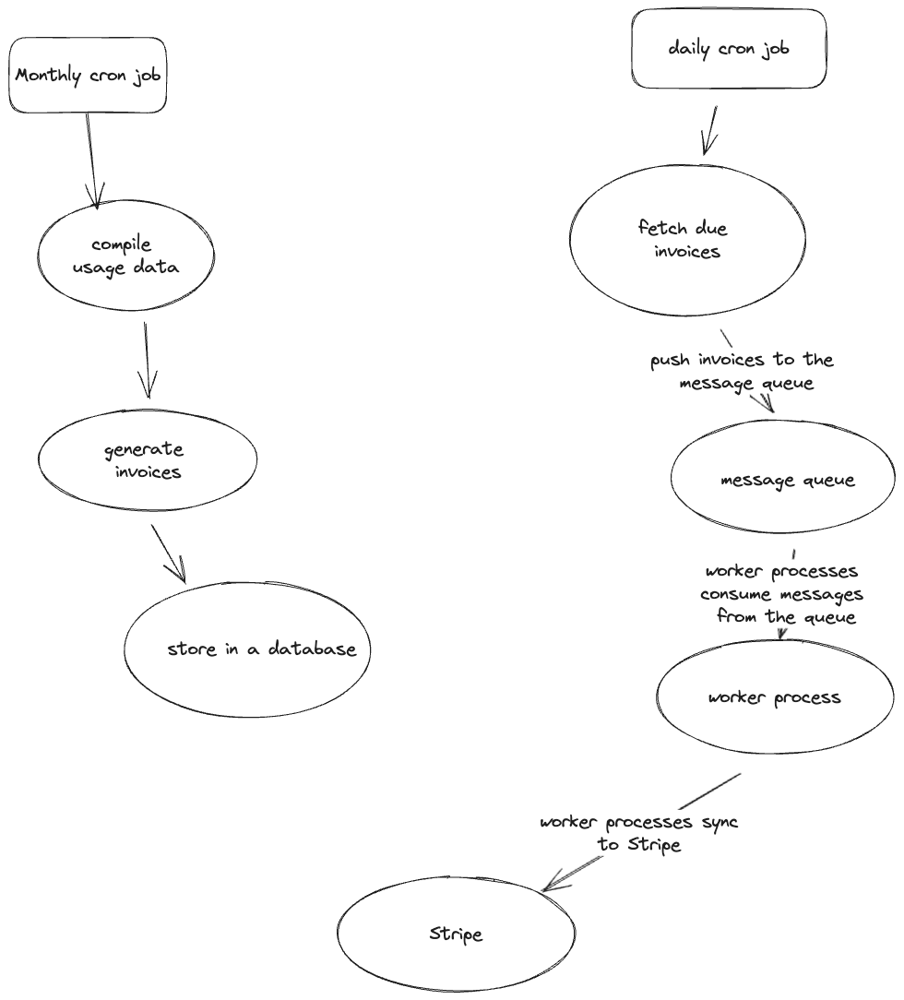

# Billing Experience Overview
The overarching goal was to prioritize the needs of our users. This involved ensuring the billing experience is seamless, predictable, and transparent. Here's a deep dive into my approach:

## Technical Architecture

The billing system is architected to provide users with a seamless user experience around usage and billing. It is designed to focus on automation, scalability, and error handling, ensuring the process runs smoothly with minimal manual intervention.

### Architecture Breakdown

* **Monthly Cron Job**
  - It runs once a month.
  - Its primary task is to compile usage data for the billing period (a month in this case).
  - Generates invoices a day before they are due and stores them in the database.
- **Daily Cron Job**:
    - Runs daily.
    - Fetches invoices that are due for that day.
    - Pushes these invoices into a RabbitMQ message queue for further processing.

- **RabbitMQ Message Queue**:
    - Acts as a buffer and ensures the system can handle spikes in invoice volumes.
    - Provides a mechanism for retries in case of failures.

- **Worker Process**:
    - Consumes messages from RabbitMQ.
    - Each worker syncs the invoice to Stripe, ensuring the billing process is distributed and can scale horizontally.
  

## Key Customer-Facing Ideas for Improving Usage and Billing Experience

- **Transparent and Detailed Billing Dashboard**: This lets customers see a detailed breakdown of their usage, expected bills, and other metrics. They should be able to view a history of their billings, current pending charges, and forecasts.
- **Notification System**: Introduce a system to notify users of any billing anomalies, pending charges, or if they're nearing a usage threshold.
- **User-Friendly Interface**: Offer an intuitive management dashboard where users can view their current and past invoices, check due dates, and understand their usage patterns.
- **Easy Issue Reporting and Resolution**: A built-in feature to report discrepancies or issues they might notice, with a resolution timeline.

- **Predictability**: Ensure the invoice generation and billing processes are predictable. Syncing should be smooth, and any issues should be communicated promptly.

## My ideas on Stripe Sync in Production

- **Retry Mechanism**: Implement a robust retry mechanism to handle failed sync attempts. This way, even if a sync fails, the system can attempt again after a specified interval.
- **Batch Processing**: Instead of aggressively syncing usage data to Stripe, we compile the usage data and generate invoices on the platform. Once an invoice is generated, it is synced to Stripe.
- **Monitoring and Alerting**: Use monitoring tools to watch the health of the syncing process. If there's a failure or delay, an alert should be sent to the operations team.
- **Backoff Strategy**: If Stripe has issues or syncing fails consecutively, implement a backoff strategy, increasing the time between retries to avoid overwhelming either system.
- **Message Queuing**: Using RabbitMQ or similar message queues, queue the invoices that need to be synced to Stripe. This allows for efficiently processing large amounts of invoices and ensures we don't overload our system or Stripe's API.
- **Rate Limit Handling**: While this prototype might not handle rate limits from Stripe, it's essential to consider it for production. If Stripe enforces rate limits, it can be gracefully handled, and requests can be queued accordingly.

### Data Consistency Issues to be Considered In Production

- **Idempotency Concerns**:
    - If an operation to sync an invoice to Stripe is retried (due to a failure or network hiccup), there's a risk of duplicating the invoice on Stripe. Stripe supports idempotency keys to ensure that requests are only processed once. They can be used when syncing to Stripe to prevent duplicate operations.
- **Out-of-Order Operations**:
    - With concurrent operations, there's a chance that operations might not be processed in the order they were initiated. For example, an update to an invoice might be processed before the invoice itself has been created in Stripe. Regular data reconciliation between Stripe and the system would be needed to Identify discrepancies and corrective mechanisms.
- **Race Conditions**:
    - Multiple processes trying to sync the same invoice simultaneously may lead to unexpected behavior or data inconsistencies. I would use locks and semaphores to ensure that data access is mutually exclusive.
- **Error Handling Inconsistencies**:
    - If not handled correctly, errors returned from Stripe (e.g., rate limits, validation errors) could result in data inconsistencies if not retried or handled appropriately. I would set up clear error and exception-handling mechanisms. Failures would need to be logged, and easy access to these logs would be set up.

## Monitoring & Error Handling

- **Monitoring**: Monitoring and alerting mechanisms ensure the syncing process runs smoothly. Metrics can include the number of failed syncs, the time taken for sync, and the amount of data synced.
- **User Notification**: If an error might affect a user's billing (like failed syncs), I would like to notify the user through email or an in-app notification.
- **Admin Dashboard**: It would be great to have internal dashboards (e.g., Grafana Dashboards) for administrators to view the status of sync processes and any errors and take corrective actions if needed.

## Communicating Errors and Problems to the User

- **Friendly Error Messages**: Instead of technical error codes/messages,  display user-friendly messages indicating what went wrong.
- **Resolution Status**: If there's an error related to their billing, It would be great to keep users updated on the resolution process. They should be able to track the status of their reported issue.
- **Proactive Communication**: Before users notice, inform them if something is amiss. It shows we're on top of things and working to rectify any issues.

## Trade-offs

- **Custom Dashboard vs. Stripe Direct**: While Stripe's dashboard might be more accessible, a custom dashboard gives us flexibility and allows a tailored experience for users. It's more work but dramatically enhances user experience.
- **Complexity vs. Robustness**: Implementing a message queue adds complexity to the system. However, the benefit is a more robust and scalable system that can handle large volumes of data without compromising the user experience.
- **Local Invoice Generation**: While generating invoices locally adds an initial overhead, it reduces the number of sync operations to Stripe, ensuring a smoother experience for users.

## Next Iteration Features

- **Predictive Billing**: Based on the user's historical usage, predict their future bills. It helps in financial planning.
- **Automated Error Recovery**: Implement logic to automatically attempt to resolve common sync issues before notifying users.
- **Optimization Tips**: Provide tips on optimizing users' usage and saving costs.
- **Billing API**: For developers who want to integrate their billing details into their systems.
- **Integration with Other Services**: While Stripe is the primary focus, we could consider integrating with other payment processors or accounting software.
- **Automated Discrepancy Checks**: Before syncing, run automatic checks to identify discrepancies in the invoices (like unusual spikes in billing) and flag them for review.
- **Invoice History on Stripe**: It would be great if Stripe maintained a history of all synced invoices for auditing purposes.
- **User Feedback Loop**: Implement a system to gather user feedback on the billing experience and use this feedback for continuous improvement.

## Other Thoughts

- **Testing**: Regularly test the syncing mechanism to ensure it's working as expected. This can be done using a staging environment with Stripe's sandbox mode.
- **Feedback Loop**: Allow users to provide feedback on their billing experience. This would help us continually refine and improve the process.
- **Immediate Sync for High Priority**: High-value invoices for critical customers can be synced immediately for faster processing.
- **Safeguards**: Implementing safeguards to ensure the same invoice isn't synced to Stripe multiple times, leading to double billing.

## Final Thoughts

The primary focus has been on ensuring a seamless and user-friendly billing experience. While technical challenges arose, my decisions were driven by the question, "What's best for the users?" By prioritizing user needs, I believe we'll build trust and foster a loyal user base.
